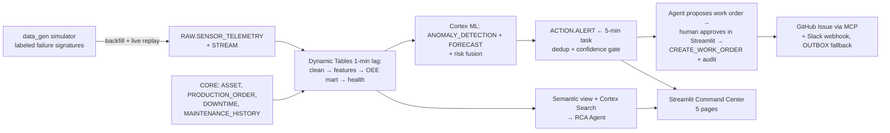

# AegisOEE — Predictive Maintenance & OEE Command Center

A closed-loop manufacturing decision system built **100% on Snowflake** and developed, tested, and operated end-to-end with **CoCo CLI** (`cortex`). It detects equipment degradation from IoT telemetry, explains the most likely root cause with cited evidence, quantifies the OEE impact, and converts a **human-approved** recommendation into a governed work order (GitHub Issue via MCP + Slack notification) with an immutable audit trail.

**The golden path (what the demo shows):** `CNC_01_SPINDLE` develops bearing wear → vibration RMS/kurtosis ramp days before failure → anomaly + failure-risk models raise a P1 alert → the RCA agent explains why, citing telemetry and maintenance history → a human approves the drafted work order → GitHub Issue + Slack ping + audit record → OEE recovered.

## Architecture



## Replicate this in your Snowflake environment

Everything is rebuilt from scratch by CoCo CLI executing the numbered mission prompts in `prompts/`. No manual SQL required.

### Prerequisites

- A Snowflake account with Cortex enabled (LLM functions + `SNOWFLAKE.ML` classes). CoCo CLI is not available on standard trial accounts.
- Privileges to create databases, warehouses, tasks, dynamic tables, streams, and Streamlit apps.
- [Snowflake CLI](https://docs.snowflake.com/en/developer-guide/snowflake-cli/index) (`snow`) and Python 3.12 with `snowflake-snowpark-python pandas numpy` (for the local data simulator).
- Optional, for the ticketing/notification leg: a GitHub fine-grained PAT (Issues: read/write) and a Slack incoming webhook. Without them the system degrades gracefully to the OUTBOX queue.

### 1 — Install CoCo CLI and connect

```bash
# macOS / Linux / WSL          (Windows native: irm https://ai.snowflake.com/static/cc-scripts/install.ps1 | iex)
curl -LsS https://ai.snowflake.com/static/cc-scripts/install.sh | sh
cortex --version
```

Define a connection named `aegis` in `~/.snowflake/connections.toml` (account, user, PAT password or `authenticator = "externalbrowser"`), `chmod 600` the file, then verify:

```bash
cortex -c aegis -p "Reply with exactly OK"
```

Any other connection name works too: `export COCO_CONN=<your_name>` — every script honors it.

### 2 — Optional integrations

```bash
export GITHUB_PAT=...            # fine-grained, Issues RW on your fork/repo
export SLACK_WEBHOOK_URL=...
cortex mcp add github https://api.githubcopilot.com/mcp/ --type http -H "Authorization: Bearer ${GITHUB_PAT}"
```

Scope MCP permissions in `~/.snowflake/cortex/permissions.json` (allow issue create/list/get/update; deny deletes).

### 3 — Preflight

```bash
bash scripts/preflight_probes.sh
```

Checks CoCo, `snow`, the connection, MCP, automations availability, and Snowflake capabilities (Cortex functions, usage views, agent-task grant). Fix any FAIL before building.

### 4 — Build everything (one command)

```bash
bash scripts/build_all.sh        # runs missions 00 → 06 headlessly, logs to docs/runs/
```

Or run missions individually — each is idempotent, writes its artifacts into the repo before executing them, and ends with `MISSION NN COMPLETE`:

| Mission | Builds | Key outputs | Checkpoint |
|---|---|---|---|
| `prompts/00_foundation.md` | DB `AEGIS_OEE`, schemas, warehouses, stages, capability probes | `sql/00_setup.sql`, `TEST.ENV_PROBES` | probe table printed |
| `prompts/01_synthetic_data.md` | 75 days of correlated telemetry/ERP/maintenance for 10 assets, labeled failure episodes, live-replay simulator, docs for search | `data_gen/`, `sql/01_ref_erp.sql`, `tests/validation_report.md` | validation all-PASS |
| `prompts/02_pipelines.md` | Streams + layered Dynamic Tables → shift OEE mart, telemetry context, asset health | `sql/02–04_*.sql` | every DT INCREMENTAL, raw→mart < 120 s, OEE reconciles |
| `prompts/03_ml.md` | Multi-series anomaly detection + forecasts + risk fusion + honest evaluation vs ground truth | `sql/05_ml_models.sql`, `tests/ml_recall_check.sql`, `TEST.ML_METRICS` | recall ≥ 0.8, lead ≥ 24 h |
| `prompts/04_semantics_agent.md` | Semantic view (15 verified queries), Cortex Search over maintenance docs, RCA agent + 25-question eval | `sql/07–09_*.sql`, `semantic/` | eval ≥ 80 %, answers cite evidence |
| `prompts/05_action_loop.md` | Alert scoring task, approval-gated work orders, audit, Slack/GitHub sync with OUTBOX fallback | `sql/06_alert_task.sql`, `sql/10_action_procs.sql` | guardrail tests PASS |
| `prompts/06_app.md` | Streamlit Command Center (Executive OEE, Alert Triage, Asset Digital Twin, Ask Aegis, Work-Order Review with parts panel) | `app/` | all pages render, approval flow works |

### 5 — Run the demo

```bash
bash scripts/inject_anomaly.sh            # streams a 30-min bearing-wear episode onto CNC_01_SPINDLE
# watch: alert appears within ~5 min → triage in the app → approve → GitHub issue + Slack + audit
bash scripts/demo_reset.sh                # restore pristine state between runs
```

Unattended operation: `prompts/triage-automation.md` (hourly triage) and `prompts/daily-oee-digest.md` (07:00 digest) run as CoCo automations — `bash scripts/with_automations.sh automation create ...` — or via cron + `cortex exec` where automations aren't enabled.

### 6 — Teardown

Drop the single database and two warehouses (`AEGIS_OEE`, `AEGIS_WH`, `AEGIS_APP_WH`); everything lives there. Tasks are created suspended and warehouses auto-suspend at 60 s, so idle cost is minimal.

## Repository map

| Path | What it is |
|---|---|
| `AGENTS.md` | Project context CoCo reads on every run: canonical data model, failure physics, OEE math, naming, guardrails. **Start here.** |
| `prompts/` | The build system — numbered mission prompts executed by `cortex exec`, plus automation prompts |
| `.cortex/skills/` | 3 reusable skills: `synthetic-iot-factory`, `oee-analytics`, `maintenance-triage` (installable in any CoCo environment) |
| `.cortex/agents/` | Specialist subagents: pipeline-engineer, ml-engineer, app-builder, qa-reviewer |
| `.cortex/hooks/sql-guard.sh` + `.cortex/settings.json` | PreToolUse guardrail — blocks destructive SQL outside `AEGIS_OEE`, logs every tool call |
| `scripts/` | Harness: `preflight_probes`, `build_all`, `inject_anomaly`, `demo_reset`, `snapshot_usage`, `with_automations` |
| `sql/`, `data_gen/`, `ml/`, `semantic/`, `app/`, `tests/` | Artifacts generated by the missions — committed so you can review them and re-run without regeneration |
| `docs/plan.md` | Build status tracker + environment runbook |
| `docs/run-records.md` | Where run transcripts, logs, and usage queries live |
| `docs/team-handoff.md`, `docs/snowsight-bootstrap.md` | Collaboration bootstraps for repo-based and Snowsight-based contributors |

## How CoCo CLI is used here

- **Planning**: architecture, ADRs, risk register, and acceptance tests produced in a `cortex --plan` session (`prompts/planning_session.md`).
- **Development**: every Snowflake object, the simulator, the semantic model, the agent, and the app are generated and executed by the missions; project skills and AGENTS.md steer the output.
- **Execution**: scheduled triage/digest run as CoCo automations (or cron + `cortex exec`); the live demo lever is also CoCo-driven.
- **Testing**: validation report, ML recall evaluation, agent eval set, and guardrail tests are run by CoCo and persisted to the `TEST` schema.

Quantitative proof from your own account after a rebuild:

```sql
SELECT interface, COUNT(*) AS requests, SUM(token_credits) AS credits
FROM SNOWFLAKE.ACCOUNT_USAGE.SNOWFLAKE_COCO_USAGE_HISTORY
GROUP BY interface;
```

## What this demonstrates

| Aspect | Where it's implemented |
|---|---|
| Technical Execution | Incremental Dynamic Tables + streams/tasks, Cortex ML anomaly + forecast with measured recall/lead-time, semantic view + Search + evaluated RCA agent, Streamlit in Snowflake, MCP ticketing, guardrail hook, subagents, reusable skills |
| Real-World Relevance | ISA-95 plant model, ISO-10816-style vibration physics, OEE/MTBF/MTTR math that reconciles, human-approval governance, imperfect-data handling (sensor faults never auto-action) |
| Solution Completeness | sensor → detect → explain → approve → ticket → audit closed loop; labeled ground truth makes accuracy measurable; OUTBOX resilience; one-command rebuild; tests, docs, demo scripts |

## Troubleshooting

- **Headless runs do nothing / "tool blocked"** — CoCo rejects tool calls in `-p`/`exec` by default; use `--bypass` (all repo scripts already do). The sql-guard hook still vets every statement.
- **"Cannot create dedicated connection: X not found"** — CoCo cached an old connection name; fix `cortexAgentConnectionName`/`sqlConnectionName` in `~/.snowflake/cortex/settings.json`.
- **"Automations are not enabled for this account"** — use `scripts/with_automations.sh` (local opt-in) or fall back to cron + `cortex exec`.
- **Cortex model errors** — use a model your account has (e.g. `llama3.1-8b`); check with `/model` in an interactive session; enable cross-region inference if the list is empty.
- **WSL users** — run `sed -i 's/\r$//' scripts/*.sh .cortex/hooks/sql-guard.sh` once, keep Python venvs outside `/mnt/c`, and set `BROWSER="powershell.exe /c start"` for browser SSO.
