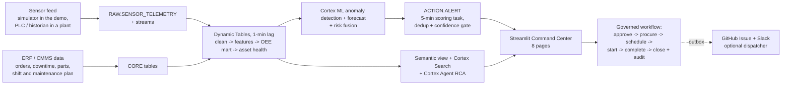

# AegisOEE — Predictive Maintenance & OEE Command Center

A closed-loop manufacturing decision system built **100% inside Snowflake** and developed, tested and operated end-to-end with **CoCo CLI** (Snowflake Cortex Code, the `cortex` command).

It detects equipment degradation from IoT sensor data days before failure, explains the most likely root cause with cited evidence, quantifies the OEE (Overall Equipment Effectiveness) at risk, and turns a **human-approved** decision into a governed maintenance job: work order, parts procurement, production-aware scheduling, repair execution, verified closure and an immutable audit trail.

**The golden path shown in the demo.** `CNC_01_SPINDLE` develops bearing wear -> vibration RMS and kurtosis ramp up -> anomaly detection and risk fusion raise an alert -> the RCA agent explains why with telemetry and maintenance-history evidence -> a person approves the drafted work order -> the parts shortage becomes a purchase requisition and an expedite recommendation -> stores receives the part -> the technician starts and completes the job and a supervisor closes it -> everything is audited. Optionally a GitHub Issue (ticket) and a Slack message are created along the way.

---

## Contents

1. [What you get](#1-what-you-get)
2. [Pick your path](#2-pick-your-path)
3. [Before you start (prerequisites)](#3-before-you-start-prerequisites)
4. [Connect to Snowflake](#4-connect-to-snowflake)
5. [Path A - Direct deploy (no CoCo, no LLM)](#5-path-a--direct-deploy-no-coco-no-llm)
6. [Path B - Full build with CoCo CLI](#6-path-b--full-build-with-coco-cli)
7. [Run the demo](#7-run-the-demo)
8. [Where the data comes from (demo vs. real plant)](#8-where-the-data-comes-from-demo-vs-real-plant)
9. [Optional: GitHub Issues and Slack](#9-optional-github-issues-and-slack)
10. [Cost control](#10-cost-control)
11. [Repository map](#11-repository-map)
12. [Troubleshooting](#12-troubleshooting)
13. [Teardown](#13-teardown)
14. [Known limitations](#14-known-limitations)

---

## 1. What you get

### Architecture


```mermaid
flowchart LR
    SIM[Sensor feed<br/>simulator in the demo,<br/>PLC / historian in a plant] --> RAW[RAW.SENSOR_TELEMETRY<br/>+ streams]
    ERP[ERP / CMMS data<br/>orders, downtime, parts,<br/>shift and maintenance plan] --> CORE[CORE tables]
    RAW --> DT[Dynamic Tables, 1-min lag<br/>clean -> features -> OEE mart -> asset health]
    CORE --> DT
    DT --> ML[Cortex ML anomaly detection + forecast<br/>+ risk fusion]
    ML --> AL[ACTION.ALERT<br/>5-min scoring task,<br/>dedup + confidence gate]
    DT --> SEM[Semantic view + Cortex Search<br/>+ Cortex Agent RCA]
    AL --> APP
    SEM --> APP[Streamlit Command Center<br/>8 pages]
    APP --> WF[Governed workflow:<br/>approve -> procure -> schedule -><br/>start -> complete -> close + audit]
    WF -. outbox .-> EXT[GitHub Issue + Slack<br/>optional dispatcher]
```

### The app (8 pages)

| Page | Who uses it | What it does |
|---|---|---|
| Executive OEE | plant manager | OEE trend, loss waterfall, line comparison, OEE at risk |
| Alert Triage | reliability engineer | ranked alerts with evidence; acknowledge / investigate / suppress |
| Asset Digital Twin | engineer | sensor trends, anomaly markers, forecast bands, health per asset |
| Ask Aegis | anyone | chat with the RCA agent (root cause, evidence, recommended action) |
| Work Order Review | planner / technician / supervisor | approve a draft, then **start -> complete -> close** the maintenance job with a lifecycle stepper; past orders; audit trail |
| Parts Procurement | stores / purchasing | requisitions (quote -> order -> receive), inventory, suppliers |
| Asset Map | manager | ISA-95 site / line / asset health tiles |
| Shift Plan | production planner | 14-day production and maintenance-window Gantt, work-order schedule, expedite flags, rebook |

### Highlights

- **Incremental Dynamic Tables** from raw telemetry to the OEE mart (OEE = Availability x Performance x Quality reconciles exactly).
- **Cortex ML** anomaly detection (vibration, temperature, RPM) and forecasts with measured accuracy against labeled ground truth.
- **Semantic view + Cortex Search + Cortex Agent** for governed natural-language analytics and RCA with a fixed answer structure.
- **Human-in-the-loop governance**: the agent only *proposes*; every state change needs a named human, has a dry-run, valid-transition checks, and writes an audit row (including rejections).
- **Parts-aware scheduling**: maintenance is scheduled into non-production windows; if the part's lead time arrives after the predicted failure the system says **EXPEDITE** and gives an order-by date.
- **Reference build results** (seeded data): ~718K telemetry rows, 10 assets, plant OEE about 75 percent, ML recall 0.90 with a 162 h lead time on the golden-path failure, 62 workflow guardrail tests and 25 validation checks passing.

---

## 2. Pick your path

| | **Path A - Direct deploy** | **Path B - Full CoCo CLI build** |
|---|---|---|
| For | anyone who just wants the system running | people who want to see/reproduce how it was built with an AI coding agent |
| Needs CoCo CLI | **No** | Yes |
| LLM / CoCo credits for deployment | **None** | Yes (a few dozen agent turns) |
| Method | committed SQL + deterministic Python data generator, run by one script | numbered mission prompts that CoCo executes |
| Result | identical objects; data is deterministic (seed 42) | same objects; produced by an agent that applies and validates the committed artifacts |
| Time | about 30-45 minutes (ML training is the long step) | about 2-3 hours |
| Start here | [Path A](#5-path-a--direct-deploy-no-coco-no-llm) | [Path B](#6-path-b--full-build-with-coco-cli) |

Both paths end in the same place: database `AEGIS_OEE`, two warehouses and a Streamlit app called `AEGIS_OEE_COMMAND_CENTER`.

---

## 3. Before you start (prerequisites)

| Need | Details |
|---|---|
| Snowflake account | Any edition with **Cortex** available (LLM functions, `SNOWFLAKE.ML` classes, Cortex Search, Cortex Agents). A role with `CREATE DATABASE` and `CREATE WAREHOUSE` (ACCOUNTADMIN is simplest). If Cortex is not available in your region, enable cross-region inference: `ALTER ACCOUNT SET CORTEX_ENABLED_CROSS_REGION = 'ANY_REGION';` |
| Snowflake CLI (`snow`) | https://docs.snowflake.com/en/developer-guide/snowflake-cli/installation/installation |
| Python 3.12 | with a virtual environment (below) |
| Bash | macOS, Linux, or **WSL** on Windows (the scripts are bash) |
| CoCo CLI | **Path B only** (see [section 6](#6-path-b--full-build-with-coco-cli)) |
| GitHub token + Slack webhook | optional, only for [section 9](#9-optional-github-issues-and-slack) |

Create the Python environment once (preferably in a folder without spaces in the path):

```bash
python3.12 -m venv ~/.venvs/aegis
source ~/.venvs/aegis/bin/activate
pip install snowflake-snowpark-python pandas numpy pyarrow requests
```

Clone the repository:

```bash
git clone https://github.com/SreekarReddyMarpadaga/AegisOEE.git
cd AegisOEE
```

> Windows users: run everything inside WSL and keep the repository on the Linux file system (for example `~/AegisOEE`) rather than under `/mnt/c/...`; file uploads to Snowflake can fail on paths with spaces.

---

## 4. Connect to Snowflake

Create `~/.snowflake/connections.toml` (permissions `600`) with a named connection. The name is up to you; the examples use `aegis`.

```toml
[aegis]
account  = "<orgname>-<accountname>"     # Snowsight: your name (bottom left) -> Account -> View account details
user     = "<YOUR_USER>"
password = "<password or programmatic access token>"
```

Check it works:

```bash
snow connection test -c aegis
snow sql -c aegis -q "select current_account(), current_role(), current_region()"
```

Notes:

- **Programmatic access token (PAT) and network policies.** Snowflake requires a network policy for PAT logins. If you see `Network policy is required`, either create the token with a bypass window (`ALTER USER <you> ADD PROGRAMMATIC ACCESS TOKEN <name> MINS_TO_BYPASS_NETWORK_POLICY_REQUIREMENT = 1440;`) or attach a network policy that allows your IP address.
- Scripts read the connection name from the `COCO_CONN` environment variable when you do not pass one: `export COCO_CONN=aegis`.

---

## 5. Path A - Direct deploy (no CoCo, no LLM)

```bash
source ~/.venvs/aegis/bin/activate
cd deploy
chmod +x deploy_all.sh load_data.sh sql/09_app.sh
./deploy_all.sh aegis            # use your connection name
```

What it does (about 30-45 minutes; machine learning training dominates):

| Step | What it creates |
|---|---|
| 01 | database `AEGIS_OEE`, 8 schemas, warehouses `AEGIS_WH` and `AEGIS_APP_WH` (XSMALL, auto-suspend 60 s), stages |
| 02 | tables (CORE, RAW, ACTION, ML, TEST, SEMANTIC) |
| 03 | data load: 75 days of seeded telemetry and ERP data (`data_gen/backfill.py`, seed 42), maintenance documents, and the 14-day shift/maintenance plan (`data_gen/cmms_plan.py`) |
| 04 | streams, 7 incremental Dynamic Tables, views |
| 05 | ML models: 3 anomaly-detection and 2 forecast models, scoring procedures, historical scoring |
| 06 | semantic view `MANUFACTURING_OPERATIONS` and Cortex Search service `MAINTENANCE_SEARCH` |
| 07 | agent tool procedures and the Cortex Agent `AEGIS_RCA_AGENT` |
| 08 | action loop: alert scoring, work orders, parts check, procurement, work-order lifecycle, audit; tasks created **suspended** |
| 11 | CMMS scheduling procedures |
| 09 | Streamlit app on the **warehouse runtime** |
| 10 | verification, prints PASS/FAIL for each check |

Useful options:

```bash
./deploy_all.sh aegis --from 06      # resume from step 06 after a failure
./deploy_all.sh aegis --only 10      # re-run only the verification
```

The script is safe to re-run and never drops the database. It finishes with a verification table.

**Open the app:** Snowsight -> **Projects** -> **Streamlit** -> `AEGIS_OEE_COMMAND_CENTER`.

All background tasks are created suspended so nothing consumes credits while idle. Resume them only when you want live detection (see [section 7](#7-run-the-demo)).

More detail on the deploy scripts: [deploy/README.md](deploy/README.md).

---

## 6. Path B - Full build with CoCo CLI

Here an AI agent (CoCo CLI) executes numbered **mission prompts** in `prompts/`. Each mission writes its artifacts into the repository, runs them against Snowflake, tests them, and prints `MISSION NN COMPLETE`.

### 6.1 Install and connect CoCo CLI

```bash
curl -LsS https://ai.snowflake.com/static/cc-scripts/install.sh | sh     # macOS / Linux / WSL
cortex --version
```

(Windows native: `irm https://ai.snowflake.com/static/cc-scripts/install.ps1 | iex`. CoCo CLI must be enabled for your Snowflake account.)

CoCo has **two** connection settings in `~/.snowflake/cortex/settings.json`: `sqlConnectionName` (where SQL runs) and `cortexAgentConnectionName` (where the model runs). Point **both** at your connection:

```bash
cortex connections set aegis
# then edit ~/.snowflake/cortex/settings.json so cortexAgentConnectionName is also "aegis"
cortex -c aegis -p "Reply with exactly OK"
```

### 6.2 Preflight

```bash
export COCO_CONN=aegis
source ~/.venvs/aegis/bin/activate
bash scripts/preflight_probes.sh
```

Fix every FAIL before building.

### 6.3 Build

```bash
bash scripts/build_all.sh        # runs the missions in order, stops on the first failure, logs in docs/runs/
```

Or run a single mission:

```bash
cortex exec --file prompts/03_ml.md -c aegis --bypass
```

(`--bypass` is required for headless runs; the SQL guard hook in `.cortex/hooks/sql-guard.sh` still blocks destructive statements outside `AEGIS_OEE`.)

| Mission | Builds | Checkpoint |
|---|---|---|
| `00_foundation` | database, schemas, warehouses, stages, capability probes | probe table |
| `01_synthetic_data` | 75 days of correlated telemetry/ERP/maintenance for 10 assets, labeled failures, live-replay simulator | validation all PASS |
| `01b_oee_realism` | realistic losses (minor stops, speed loss, rejects), plant OEE about 0.62-0.80 | dry-run acceptance checks |
| `02_pipelines` | streams and Dynamic Tables, OEE marts | all DTs incremental, OEE reconciles |
| `03_ml` | anomaly detection, forecasts, risk fusion, honest evaluation | recall >= 0.8, lead time >= 24 h |
| `04_semantics_agent` | semantic view, Cortex Search, RCA agent, 25-question evaluation | eval >= 80 percent |
| `05_action_loop` | alert scoring, approval-gated work orders, parts check, audit, outbox | guardrail tests PASS |
| `06_app` / `06b_app_warehouse_runtime` | Streamlit command center on the warehouse runtime | pages render, runtime verified |
| `07_cmms_shift_planning` / `07b_cmms_hardening` | shift plan, maintenance windows, parts-aware scheduling | scheduling tests PASS, eval >= 90 percent |
| `08_parts_procurement` | separate procurement page and guarded requisition lifecycle | M08 tests PASS |
| `09_work_order_execution` | start / complete / close lifecycle linked to procurement; non-LLM demo scripts | end-to-end chain PASS |
| `10_direct_deploy` | regenerates the Path A deploy folder from the live account and proves it on a clean account | parity report, clean deploy PASS |

### 6.4 Is the build deterministic?

An AI agent does not reproduce text byte for byte, so the repository separates what must be exact from what can be generated:

- **Exact, from files**: seeded data generation (seed 42), SQL objects, semantic YAML, agent spec, app code and the stage-based app deploy script are committed. Missions are instructed to run and validate these artifacts first and only regenerate or modify them when a check fails (see "Reproducibility contract" in `AGENTS.md`).
- **Agent-driven**: planning, diagnosis, evaluation, fixing failures, and operating the system.
- **Acceptance tests decide**: every mission ends with measurable checks (row counts, OEE reconciliation, recall, eval scores, guardrail tests) stored in the `TEST` schema. If a run drifts, a check fails instead of silently passing.

If you need an exact copy of a known-good state, use [Path A](#5-path-a--direct-deploy-no-coco-no-llm).

---

## 7. Run the demo

Everything below assumes `export COCO_CONN=<your connection>` and that the virtual environment is active.

```bash
# 1) clean demo state (pure SQL, no CoCo)
bash scripts/demo_reset.sh

# 2) resume the two live tasks (anomaly scoring and alert scoring)
snow sql -c $COCO_CONN -q "ALTER TASK AEGIS_OEE.ML.TASK_DETECT_ANOMALIES RESUME"
snow sql -c $COCO_CONN -q "ALTER TASK AEGIS_OEE.ACTION.TASK_SCORE_ALERTS RESUME"

# 3) push a live bearing-wear episode into the telemetry table (mock sensor feed)
bash scripts/inject_anomaly.sh CNC_01_SPINDLE BEARING_WEAR 15
```

An alert appears roughly 10-15 minutes after the injection starts. Check:

```bash
snow sql -c $COCO_CONN -q "select alert_id, asset_id, severity, status, predicted_mode from AEGIS_OEE.ACTION.ALERT order by onset_ts desc"
```

**CoCo CLI (optional, shows the skills):** start `cortex -c $COCO_CONN` in this folder and try:

```
$maintenance-triage Triage the open alerts in AEGIS_OEE. For the top alert show the evidence bundle, the parts check and the proposed work order draft. Do not create or approve anything.
$oee-analytics Using the MANUFACTURING_OPERATIONS semantic view, how much OEE is at risk on LINE_1 if CNC_01_SPINDLE fails during Shift A?
Run: cortex agents run AEGIS_OEE.ACTION.AEGIS_RCA_AGENT "Why is CNC_01_SPINDLE at risk and when can we fix it without losing production?"
```

**App walk-through (the human-approved loop):**

1. **Alert Triage** -> expand the alert -> *Show evidence* -> **Acknowledge**.
2. **Work Order Review -> Pending Drafts** -> check *Parts Readiness* (the spindle bearing kit is intentionally short) -> enter an approver name -> tick the confirmation -> **Approve**.
3. **Shift Plan -> WO Schedule** -> the order shows **EXPEDITE** with an order-by date.
4. **Parts Procurement -> Requisitions** -> *Update status* QUOTED -> ORDERED -> RECEIVED (name + confirm + **Confirm**). Receiving reserves the stock for the work order.
5. **Work Order Review -> Active Work Orders** -> **Start Work** (blocked until parts are received) -> **Complete Work** (finding, action taken, labor hours, outcome) -> **Close Work Order** (a different person than the technician, with a verification note).
6. **Audit History** shows every attempt, including rejections.

Stop spending credits and restore a pristine state afterwards:

```bash
snow sql -c $COCO_CONN -q "ALTER TASK AEGIS_OEE.ML.TASK_DETECT_ANOMALIES SUSPEND"
snow sql -c $COCO_CONN -q "ALTER TASK AEGIS_OEE.ACTION.TASK_SCORE_ALERTS SUSPEND"
bash scripts/demo_reset.sh
```

A self-check of the whole workflow without the UI (alert -> approval -> procurement -> start -> complete -> close) is available as `bash scripts/demo_e2e_check.sh`.

---

## 8. Where the data comes from (demo vs. real plant)

Snowflake is the system of record. Dynamic Tables, ML, alerts, agent and dashboard only read Snowflake tables, so they do not care how rows arrive.

| Data | In this repository (demo) | In a real plant |
|---|---|---|
| Sensor telemetry | `data_gen/backfill.py` loads 75 days of seeded history; `data_gen/simulator.py` (run by `scripts/inject_anomaly.sh`) streams a compressed failure episode into `RAW.SENSOR_TELEMETRY` | PLC / SCADA / historian gateways write the same table (for example with Snowpipe Streaming) |
| Production orders, downtime, maintenance history | seeded and correlated with the failures | ERP / MES |
| Parts inventory, suppliers, lead times | seeded (30 parts; the spindle bearing kit is deliberately short) | ERP / warehouse system |
| Shift plan and maintenance windows | seeded by `data_gen/cmms_plan.py` for 14 days, relative to the run date | CMMS / production planning |
| Failure ground truth | only in the `TEST` schema, used to measure accuracy, never an ML input | does not exist (this is why accuracy is measurable here) |

---

## 9. Optional: GitHub Issues and Slack

When a work order is approved the system queues a **GitHub Issue** (the maintenance ticket, with evidence, parts table, requisition quote and safety statement) and a **Slack message** in an outbox table (`ACTION.WORK_ORDER_OUTBOX`). Nothing is lost if delivery is not configured.

Tasks and stored procedures in a standard Snowflake account have no outbound internet access. For this demo environment a small local program, the **outbox dispatcher**, delivers the outbox rows and mirrors state back (closing a work order closes its issue). **It is not needed in production**, and the whole maintenance workflow works inside Snowflake without it. In a production account an administrator creates an External Access Integration with secrets (see `sql/11_integrations.sql` for the native procedure versions) or a notification integration, and the same outbox delivers from inside Snowflake.

To run the dispatcher:

1. Create a **fine-grained GitHub personal access token** with *Issues: read and write* on the one repository that should receive the issues.
2. Create a **Slack incoming webhook** for one channel.
3. Export them in your terminal (never commit them) and run:

```bash
export GITHUB_PAT='<token>'
export SLACK_WEBHOOK_URL='<webhook url>'
export GITHUB_REPO='<owner>/<repository>'
export DISPATCH_INTERVAL_S=15        # poll every 15 s; omit to run once
python scripts/outbox_dispatcher.py
```

Keep `TASK_OUTBOX_RETRY` suspended while the dispatcher runs, otherwise Slack messages can be sent twice.

---

## 10. Cost control

- All tasks are created **suspended**. Resume only `TASK_DETECT_ANOMALIES` and `TASK_SCORE_ALERTS` while demonstrating (each runs every 5 minutes); an idle running task costs credits every day.
- Warehouses are XSMALL with 60-second auto-suspend; Dynamic Tables are close to free when no new data arrives.
- The app runs on the **warehouse runtime**. Do not use the container runtime or a compute pool: that bills while the app is open.
- Check usage: `SELECT * FROM SNOWFLAKE.ACCOUNT_USAGE.WAREHOUSE_METERING_HISTORY ORDER BY START_TIME DESC LIMIT 50;` and, for CoCo, `SNOWFLAKE.ACCOUNT_USAGE.SNOWFLAKE_COCO_USAGE_HISTORY`.

---

## 11. Repository map

| Path | What it is |
|---|---|
| `deploy/` | **Path A**: ordered SQL, `deploy_all.sh`, verification, parity report |
| `prompts/` | **Path B**: numbered mission prompts executed by `cortex exec`, plus automation prompts |
| `AGENTS.md` | project context CoCo reads on every run: data model, failure physics, OEE math, naming, guardrails, reproducibility contract |
| `.cortex/skills/` | reusable skills: `synthetic-iot-factory`, `oee-analytics`, `maintenance-triage` |
| `.cortex/agents/` | specialist subagents: pipeline-engineer, ml-engineer, app-builder, qa-reviewer |
| `.cortex/hooks/` | guardrail hook that blocks destructive SQL outside `AEGIS_OEE` |
| `sql/`, `semantic/`, `cortex_project/` | SQL objects, semantic model, agent specification |
| `data_gen/` | seeded data generator (`backfill.py`), CMMS plan generator (`cmms_plan.py`), live simulator (`simulator.py`) |
| `app/` | Streamlit app (8 pages) |
| `scripts/` | `build_all.sh`, `preflight_probes.sh`, `inject_anomaly.sh`, `demo_reset.sh`, `demo_e2e_check.sh`, `outbox_dispatcher.py` |
| `tests/` | validation report, ML recall check, agent evaluation |
| `docs/` | plan, ADRs, risk register, run records |

---

## 12. Troubleshooting

| Symptom | Fix |
|---|---|
| `Network policy is required` | PAT login needs a network policy or a bypass window (see [section 4](#4-connect-to-snowflake)). With CoCo also check that **both** `sqlConnectionName` and `cortexAgentConnectionName` point at the right connection. |
| `getaddrinfo EAI_AGAIN` / name resolution fails in WSL | WSL lost DNS (often after a network or VPN change). Restart WSL (`wsl --shutdown` from Windows) or add your DNS server to `/etc/resolv.conf`. |
| Streamlit app opens on a container runtime / compute pool | Newer Snowflake releases default `CREATE STREAMLIT` and `snow streamlit deploy` to the container runtime. Deploy with `deploy/sql/09_app.sh`, which creates the app from a stage with `RUNTIME_NAME = 'SYSTEM$WAREHOUSE_RUNTIME'`. Verify with `DESCRIBE STREAMLIT AEGIS_OEE.APP.AEGIS_OEE_COMMAND_CENTER` (`compute_pool` must be empty). |
| App error after a click mentioning `experimental_rerun` | Use `st.rerun()` (already used throughout this repository). |
| File upload (`PUT`) fails | Move the repository to a path without spaces, for example `~/AegisOEE`. |
| `Cortex model not found` | Use a model available to your account (for example `llama3.1-8b`) and enable cross-region inference. |
| Headless CoCo run does nothing | Add `--bypass` (all repository scripts already do). |
| No alert after injecting data | Both tasks must be `started` (`SHOW TASKS IN DATABASE AEGIS_OEE`). The alert needs about 10-15 minutes. |
| `Start Work` is rejected | The parts are not received yet: Parts Procurement -> move the requisition to RECEIVED. |
| Close is rejected | The approver must be a different person than the technician. |
| Dispatcher shows `no credential` or connection errors | Export `GITHUB_PAT`, `GITHUB_REPO`, `SLACK_WEBHOOK_URL` in the same terminal and check DNS (`getent hosts api.github.com`). |
| Windows line endings break scripts | `sed -i 's/\r$//' scripts/*.sh deploy/*.sh deploy/sql/*.sh` |

---

## 13. Teardown

```sql
DROP DATABASE IF EXISTS AEGIS_OEE;
DROP WAREHOUSE IF EXISTS AEGIS_WH;
DROP WAREHOUSE IF EXISTS AEGIS_APP_WH;
```

Everything lives in that one database and the two warehouses.

---

## 14. Known limitations

- All plant data is synthetic; accuracy numbers are measured against seeded ground truth.
- External notifications need the local dispatcher in account types without outbound network access (see [section 9](#9-optional-github-issues-and-slack)).
- On raw 5-minute events the ML false-alert rate is high (about 10 per asset-day); the persistence and confidence gates suppress most of it before an alert is created.
- Model training can vary slightly between runs, so recall and lead-time figures may differ by a few percent.
